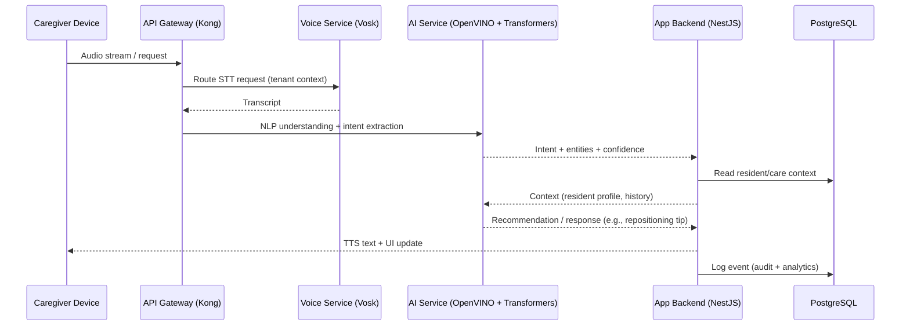

# Elder Realms AI — SaaS-ready Open Source Platform for Elder Care Facilities

Version: 1.0 (MVP Draft)
Status: MVP demo ready (offline-capable via PouchDB + Service Worker)
License: MIT (see `LICENSE`)

---

## Overview

Elder Realms AI is a cloud-first, AI-powered, data management and care support platform designed for elderly care homes and facilities. The platform centralizes resident data, augments caregiver workflows with AI-assisted tooling, and provides analytics for operational decision-making. It is built on 100% free and open-source technologies to keep total cost of ownership low and flexibility high.

Core problems addressed:
- Resident repositioning comfort and safety
- Personalized meal tracking & nutrition alerts
- Back strain reduction for caregivers
- Improved resident–staff communication (voice assist + translations)
- Centralized data for compliance, insights, and collaboration

---

## MVP Goals

- Enable real-time tracking of residents’ needs, preferences, and health data.
- Integrate AI-assisted communication (voice-to-text, text-to-voice, clarity/translation).
- Provide ergonomic, AI-guided repositioning recommendations per resident.
- Offer a responsive web dashboard with offline-first access and auto-sync.
- Build entirely on open-source technology.

Scalability goals:
- IoT sensor integration (beds, wearables)
- Predictive analytics for fall risk, nutrition, and caregiver workload
- Multi-facility support with robust APIs and healthcare integrations

---

## Core Features (MVP)

1) Resident Management
- Resident profiles (health records, dietary preferences, mobility)
- Photo, audio, note attachments
- Care plans with AI-suggested updates

2) AI Communication Assistant
- Voice-to-text & text-to-voice
- Automatic clarity/translation assist (accents, soft voices)
- Quick responses for common needs

3) Repositioning Comfort System
- AI-guided repositioning recommendations
- Safe lift/turn tutorials (video/animated)
- Event logging for care history

4) Nutrition & Meal Feedback
- Digital menus and resident feedback
- AI-driven satisfaction analysis
- Allergy & dietary restriction alerts

5) Caregiver Support Tools
- Ergonomic tips and guidance
- Automated reminders for scheduled care
- Task assignment and completion tracking

6) Facility Analytics
- Care quality metrics
- Staff workload heatmaps
- Resident satisfaction trends

---

## Open Source Tech Stack

- Frontend Web: React.js + Tailwind CSS
- Frontend Mobile: React Native (future)
- Backend: Node.js (NestJS) — REST & GraphQL
- Database: PostgreSQL (primary)
- Offline Sync: CouchDB (server) + PouchDB (client)
- AI/ML: OpenVINO + HuggingFace Transformers
- Voice Processing: Vosk (offline STT)
- Authentication: Keycloak (OIDC/OAuth2)
- File Storage: MinIO (S3-compatible)
- Hosting/Orchestration: Docker + Kubernetes (K3s)
- Monitoring: Prometheus + Grafana
- CI/CD: GitHub Actions
- API Gateway: Kong Gateway
- Documentation: Docusaurus

Note: This repository currently contains a Vite/Tailwind web scaffold (`index.html`, `src/`, `vite.config.js`). The broader SaaS architecture below outlines the target system as we grow into a multi-service platform.

---

## Multi-Tenant SaaS Architecture (System Diagram)

```mermaid
flowchart LR
  subgraph Client
    W[Web Dashboard (React + Tailwind)]
    M[Mobile App (React Native)]
    P[PWA Offline Cache (PouchDB)]
  end

  subgraph Edge
    CDN[CDN / Static Hosting]
    G[Kong API Gateway]
  end

  subgraph Auth
    K[Keycloak]
  end

  subgraph Services
    A[App Backend (NestJS REST/GraphQL)]
    AI[AI Service (OpenVINO + Transformers)]
    V[Voice Service (Vosk STT/TTS Wrapper)]
    SY[Sync Service (CouchDB)]
    FS[File Service (MinIO)]
    AN[Analytics Service]
  end

  subgraph Data
    PG[(PostgreSQL\n(Multi-tenant schemas/row-level))]
    CB[(CouchDB)]
    OB[(Object Storage\nMinIO)]
    MQ[(Event Bus / Queue)]
  end

  subgraph Ops
    CI[GitHub Actions]
    K3s[K3s (Kubernetes)]
    PR[Prometheus]
    GR[Grafana]
  end

  W -->|HTTPS| CDN
  M -->|HTTPS| CDN
  P <--> SY
  CDN --> G
  G --> A
  G --> AI
  G --> V
  G --> SY
  G --> FS
  G --> AN
  A -->|OIDC| K
  A <--> PG
  AI <--> PG
  V --> A
  SY <--> CB
  FS <--> OB
  A --> MQ
  AN --> PG
  AN --> MQ

  CI --> K3s
  K3s --> A
  K3s --> AI
  K3s --> V
  K3s --> SY
  K3s --> FS
  K3s --> AN
  PR --> K3s
  K3s --> PR
  PR --> GR
```

---

## Multi-Tenant Data Model (High-Level)

Tenancy options (choose based on regulatory and ops needs):
- Schema-per-tenant
- Row-level security (RLS) with tenant_id

```mermaid
erDiagram
  TENANT ||--o{ FACILITY : contains
  FACILITY ||--o{ RESIDENT : houses
  FACILITY ||--o{ USER : employs
  RESIDENT ||--o{ CARE_PLAN : has
  RESIDENT ||--o{ MEAL_FEEDBACK : submits
  RESIDENT ||--o{ REPOSITION_EVENT : logs
  USER ||--o{ TASK : performs

  TENANT {
    uuid id PK
    text name
    jsonb billing_meta
    timestamptz created_at
  }
  FACILITY {
    uuid id PK
    uuid tenant_id FK
    text name
    jsonb address
    timestamptz created_at
  }
  USER {
    uuid id PK
    uuid facility_id FK
    text role  // admin, caregiver, manager
    text email
    text external_auth_id // Keycloak subject
    timestamptz created_at
  }
  RESIDENT {
    uuid id PK
    uuid facility_id FK
    text full_name
    text mobility_status
    jsonb dietary_prefs
    jsonb medical_profile
    timestamptz created_at
  }
  CARE_PLAN {
    uuid id PK
    uuid resident_id FK
    jsonb plan
    timestamptz updated_at
  }
  MEAL_FEEDBACK {
    uuid id PK
    uuid resident_id FK
    text menu_item
    int rating // 1-5
    text notes
    timestamptz created_at
  }
  REPOSITION_EVENT {
    uuid id PK
    uuid resident_id FK
    text technique
    jsonb sensor_data
    timestamptz occurred_at
  }
  TASK {
    uuid id PK
    uuid user_id FK
    uuid resident_id FK
    text type
    text status
    timestamptz due_at
    timestamptz completed_at
  }
```

RLS example (PostgreSQL):
- Tables include `tenant_id` (or derivable via `facility.tenant_id`).
- Policies restrict `SELECT/INSERT/UPDATE/DELETE` by `current_setting('app.tenant_id')`.
- API sets `SET app.tenant_id = '<tenant-uuid>'` per request via gateway/middleware.

---

## AI Flow (Voice, NLP, Recommendations)



Recommendation loop:
- Use historical events and feedback to personalize prompts and model features per resident.
- Edge caching of common responses for latency; fall back to on-device/offline where possible.

---

## Security, Compliance, and Data Governance

- Identity & Access: Keycloak (OIDC/OAuth2), role-based access (admin/caregiver/resident/family)
- Tenant Isolation: RLS, schema-per-tenant option, scoped object storage buckets
- Data Encryption: TLS in transit; disk-level encryption and/or application-level where needed
- Secrets: Kubernetes secrets / sealed-secrets; no secrets in repo
- Auditability: Append-only event logs for critical actions
- Compliance: HIPAA/GDPR readiness via access controls, data minimization, retention policies
- Observability: Structured logs, traces, metrics (Prometheus/Grafana)

---

## Local Development

This repo currently includes a Vite + Tailwind web scaffold:
- Entry: `index.html`
- App: `app.js`, `src/main.js`, `src/styles.css`
- Build tooling: `vite.config.js`, `tailwind.config.cjs`, `postcss.config.cjs`

Quick start (Web):
1) Node.js 18+ and pnpm/npm installed
2) Install deps: `npm install` or `pnpm install`
3) Start dev server: `npm run dev`
4) Open the local URL printed by Vite

Planned monorepo structure (future):
- `apps/web` — React web app
- `apps/mobile` — React Native app
- `services/api` — NestJS API
- `services/ai` — AI microservice (OpenVINO + Transformers)
- `services/voice` — Vosk wrapper
- `infra/` — Helm charts, K3s manifests, GitHub Actions
- `docs/` — Docusaurus site

---

## Deployment (Target)

- Containers: Docker images for each service
- Orchestration: K3s in staging/prod; single-node dev cluster acceptable
- Ingress: Kong Gateway (rate limiting, auth, routing)
- CI/CD: GitHub Actions build/test/deploy to K3s
- Config: environment variables + Kubernetes secrets
- Storage: PostgreSQL (managed or self-hosted), MinIO, CouchDB

---

## Rollout Plan

- Phase 1: Web dashboard + resident management + AI communication assistant
- Phase 2: Mobile caregiver app + repositioning guidance system
- Phase 3: Nutrition tracking + analytics dashboard
- Phase 4: IoT integrations + predictive AI

---

## Risks & Mitigations

- Adoption resistance → In-app onboarding, simple UX, minimal clicks
- Speech recognition variance → Multiple models + local dialect training
- Caregiver overload → Clear workflows, task batch actions, quick responses

---

## Contribution Guidelines

- PRs welcome. Please open an issue for feature proposals.
- Follow conventional commits and include concise PR descriptions.
- Ensure no secrets or PHI in code, logs, or fixtures.

---

## Roadmap Highlights

- AI personalization per resident
- Regional compliance packs (HIPAA, GDPR, Ghana Health Service)
- Telehealth & EMR integrations
- Third-party add-on marketplace

---

## Acknowledgments

Built with a commitment to open-source, accessibility, and dignity-centered elder care.
